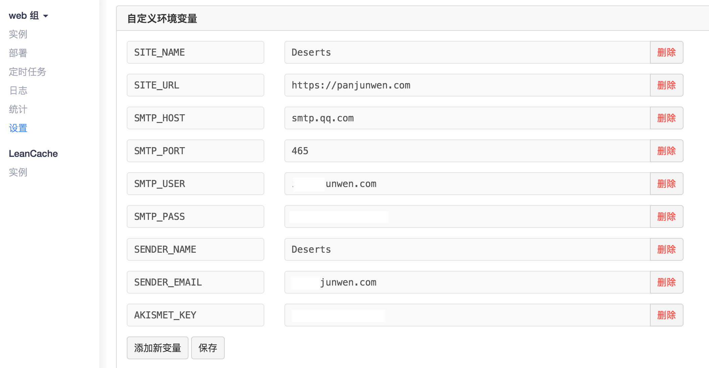

# Valine Admin
使用 LeanCloud 存储你的评论数据，在 LeanEngine 云引擎上管理你的评论，包括邮件通知和垃圾评论标记。

这是用于 [Valine -- 一款极简的评论系统](https://github.com/panjunwen/Valine/) 的后台管理，可以一键部署到你的 LeanCloud。它可以帮你完成：

- 更好用的邮件通知：包括新评论通知和@评论通知
- 基于 Akismet 的垃圾评论自动标注
- 评论管理

[评论在线演示](https://panjunwen.github.io/Valine/)

[后台评论管理演示](https://valine.leanapp.cn)

## 一键部署
1. [](https://leancloud.cn/1.1/engine/deploy-button)


2. 此外，你需要设置云引擎的环境变量以提供必要的信息，如下示例：

   

   ​

   请正确填写 SMTP 服务器信息，部分邮箱需要单独的 SMTP 密码。

   如果你用过 WordPress 你应该有 Akismet Key；如果还没有，你可以去 [ AKISMET FOR DEVELOPERS 网站](https://akismet.com/development/) 免费申请一个；如果你不需要反垃圾评论，Akismet Key可以随便填写。 

3. 设置二级域名后你可以访问后台。后台管理需要登录，**使用 _User 表中的注册用户即可**。

   **特别提醒：为确保数据安全，请合理设置数据库权限。**

## 评论安装

[Valine on Github](https://github.com/panjunwen/Valine)

## 数据迁移

[Disqus2LeanCloud](http://disqus.panjunwen.com/)

## 本地运行

**以下内容仅用于 LeanEngine 开发，普通用户无需理会**

首先确认本机已经安装 [Node.js](http://nodejs.org/) 运行环境和 [LeanCloud 命令行工具](https://leancloud.cn/docs/leanengine_cli.html)，然后执行下列指令：

```
$ git clone https://github.com/panjunwen/ValineAdmin.git
$ cd ValineAdmin
```

安装依赖：

```
npm install
```

登录并关联应用：

```
lean login
lean switch
```

启动项目：

```
lean up
```

之后你就可以在 [localhost:3000](http://localhost:3000) 访问到你的应用了。

## 部署到 LeanEngine

部署到预备环境（若无预备环境则直接部署到生产环境）：
```
lean deploy
```

## License

[MIT License](https://github.com/panjunwen/LeanComment/blob/master/LICENSE)